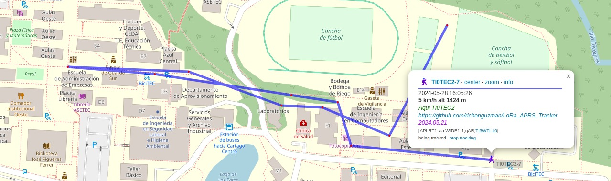

# Proyecto basado en "Richonguzman / CA2RXU LoRa APRS Tracker/Station"

## Descripción
Este repositorio contiene el firmware para un rastreador y estación APRS utilizando placas basadas en ESP32 con módulos LoRa y GPS. Basado en el proyecto original de [Richonguzman / CA2RXU LoRa APRS Tracker/Station](https://github.com/richonguzman/LoRa_APRS_Tracker).

## Funcionalidades Principales de la placa LILYGO LoRa32

- **Mensajería y Reportes Meteorológicos**:
  - Lectura, escritura y eliminación de mensajes mediante un teclado I2C o un teléfono.
  - Solicitud de reportes meteorológicos.
  - Escucha de otros rastreadores en el área.

- **Gestión de Energía y Pantalla**:
  - Reducción de la velocidad del procesador de 240MHz a 80MHz para ahorrar aproximadamente un 20% de consumo energético.
  - La pantalla OLED muestra datos como altitud, velocidad, rumbo, datos meteorológicos y mensajes recibidos.
  - Modos de ahorro de energía en la pantalla y ajuste del brillo.

- **Conectividad Bluetooth y Notificaciones**:
  - Capacidad de conectarse a aplicaciones de Android (APRSDroid) y iPhone (APRS.fi) para funciones TNC (Terminal Node Controller).
  - Notificaciones LED para transmisión y recepción de mensajes.
  - Notificaciones sonoras utilizando un módulo de zumbador YL44.

- **Telemetría y Datos Meteorológicos**:
  - Transmisión de datos meteorológicos utilizando un módulo BME280.
  - Envío de correos electrónicos a través de APRSLink utilizando Winlink.

- **Frecuencias y Compatibilidad de Hardware**:
  - Posibilidad de cambiar entre tres frecuencias principales utilizadas por LoRa APRS a nivel mundial.
  - Soporte para varios módulos de hardware, incluyendo Heltec V3, Lilygo TTGO T-Deck, y otros modelos de ESP32 y LoRa.

- **Modos y Funcionalidades Adicionales**:
  - Modo DigiRepeater para situaciones de emergencia.
  - Soporte para la detección automática de módulos BME y BMP (BME280/BMP280/BME680).
  - Capacidad para desconectar el rastreador con tres pulsaciones del botón central en los modelos T-Beams.

## Instalación y Configuración

Para cualquier consulta detallada puedes consultar el repositorio original de RichonGuzman en [LoRa](https://github.com/richonguzman/LoRa_APRS_Tracker) para obtener guías detalladas sobre la instalación, configuración del rastreador, selección del entorno, carga del firmware y el sistema de archivos, y uso de la guía de menús del rastreador. También se proporcionan instrucciones para agregar módulos adicionales como teclado, BME280, LEDs y zumbadores.

## Resultado del proyecto

En la siguiente imagen se muestra un recorrido de prueba observado en el sitio aprs.fi 

